# Classifying Brain Age from Resting-State EEG

**An end-to-end computational neuroscience pipeline that distinguishes younger from older adults using the spectral signature of their resting brain activity.**


---

## Overview

Healthy aging changes the rhythms of the resting brain. Electroencephalography (EEG) records these rhythms non-invasively, and their balance across frequency bands is known to shift across the adult lifespan. This project asks a simple, measurable question:

> **Can a person's age group be predicted from a few minutes of eyes-closed resting EEG alone?**

Using recordings from 405 healthy adults in the open Dortmund Vital Study dataset, the pipeline downloads raw EEG, cleans it, decomposes each recording into its frequency components with Fourier-based spectral analysis, and trains machine-learning classifiers to separate younger (20-34 years) from older (52-70 years) adults. Every stage is documented in a dedicated notebook, and the evaluation is designed to report honest, unbiased performance on people the model has never seen.

### Key results

| | Result |
|---|---|
| **Classification performance** (gradient boosting, nested cross-validation) | ROC AUC **0.895 ± 0.017**, accuracy **79.5%** (chance: 0.500 / 51.6%) |
| **Statistical significance** (label-permutation test, 100 permutations) | AUC 0.902 vs. 0.495 under shuffled labels, **p = 0.0099** |
| **Linear baseline** (regularized logistic regression) | ROC AUC **0.904 ± 0.027**, accuracy **83.0%**: comparable performance |
| **Most informative rhythm** | **Beta band (13-30 Hz)**, higher in older adults |
| **Robustness to muscle artifact** | Removing all gamma features: AUC 0.902 → 0.895 |

<p align="center">
  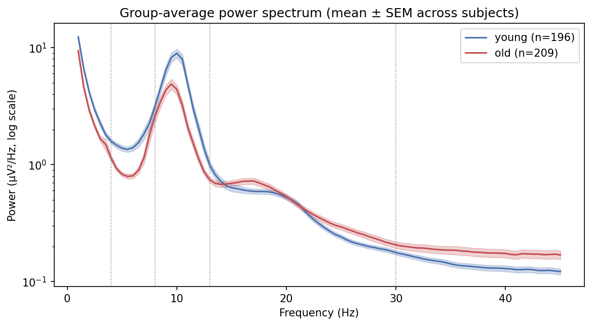
</p>
<p align="center"><em>Average resting-state power spectrum of younger and older adults (mean ± SEM). Younger adults show a markedly stronger alpha rhythm (~10 Hz); older adults show relatively more fast (beta and gamma) activity.</em></p>

---

## Pipeline

```mermaid
flowchart LR
    A["OpenNeuro ds005385<br/>608 adults, resting EEG"] --> B["Cohort definition<br/>youngest vs. oldest third<br/>416 subjects"]
    B --> C["Data access<br/>pre-task, eyes-closed<br/>EDF recordings, ~9 GB"]
    C --> D["Preprocessing<br/>notch + 0.5-45 Hz filter<br/>average reference<br/>4 s epochs, artifact rejection"]
    D --> E["Quality control<br/>at least 10 clean epochs<br/>405 subjects"]
    E --> F["Spectral features<br/>Welch PSD<br/>relative band power<br/>+ alpha peak = 321 features"]
    F --> G["Classification<br/>nested cross-validation<br/>gradient boosting vs.<br/>logistic regression"]
    G --> H["Interpretation<br/>permutation test<br/>band importance<br/>ablations"]
```

| Notebook | Stage | Runs on |
|---|---|---|
| [`00_setup_and_metadata_exploration`](notebooks/00_setup_and_metadata_exploration.ipynb) | Participant metadata, recording selection, young/old cohort definition | Google Colab |
| [`01_subject_subset_selection_and_data_access`](notebooks/01_subject_subset_selection_and_data_access.ipynb) | Parallel download of 416 recordings from OpenNeuro's public S3 bucket, integrity checks | Google Colab |
| [`02_preprocessing`](notebooks/02_preprocessing.ipynb) | Filtering, re-referencing, epoching, artifact rejection | Google Colab |
| [`03_spectral_feature_extraction`](notebooks/03_spectral_feature_extraction.ipynb) | Welch power spectra, relative band power, alpha peak frequency, group comparisons | Google Colab |
| [`04_gradient_boosting_classifier`](notebooks/04_gradient_boosting_classifier.ipynb) | Nested cross-validation, significance testing, feature importance, ablations | Local |

Notebooks 00-03 handle large raw data and run on Google Colab (connected through VS Code) for its bandwidth; Notebook 04 needs only the small feature matrix and runs locally in a few minutes.

---

## Dataset

**DS005385: Resting-state EEG data before and after cognitive activity across the adult lifespan and a 5-year follow-up** (Dortmund Vital Study; [OpenNeuro](https://openneuro.org/datasets/ds005385), CC0 license).

- 608 healthy adults aged 20-70, recorded at the Leibniz Research Centre for Working Environment and Human Factors, Dortmund, Germany
- 64-channel EEG (actiCAP, 10-20 layout), 1000 Hz sampling rate, FCz online reference
- Three-minute eyes-open and eyes-closed resting recordings, each acquired **before** (`acq-pre`) and **after** (`acq-post`) a roughly 2-hour battery of cognitive experiments

**Recording selected for this project:** session 1 (baseline), eyes-closed, **pre-task**. Eyes-closed rest is the standard condition for studying the alpha rhythm, and the pre-task recording is the undisturbed resting baseline; the post-task recording reflects mental fatigue, which would act as an uncontrolled confound for an age classifier.

Data are read directly from OpenNeuro's public AWS S3 bucket; no account or credentials are required.

<p align="center">
  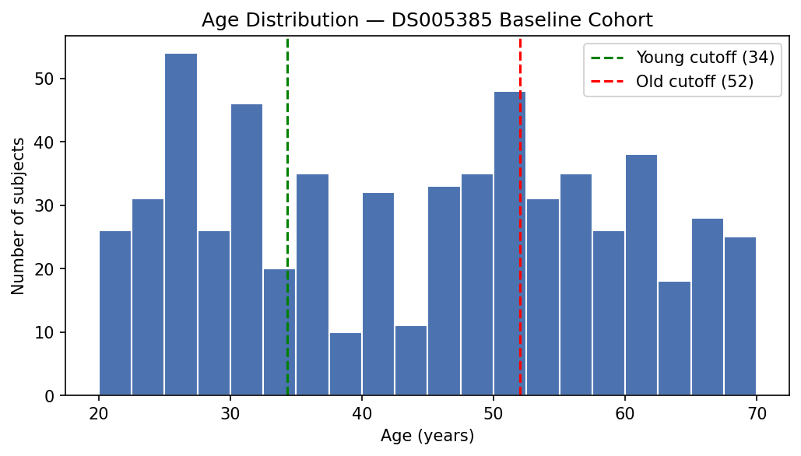
</p>
<p align="center"><em>Age distribution of the 608 participants. The youngest third (≤ 34 years) and oldest third (≥ 52 years) form the two classes; the middle third is excluded to sharpen the contrast between groups.</em></p>

---

## Methods

### 1. Cohort definition (Notebook 00)
Age in this dataset is continuous, so two groups were defined with a data-driven **percentile split**: subjects in the youngest third were labeled *young* and those in the oldest third *old*, while the middle third was excluded. This mirrors extreme-groups designs common in aging research and avoids an arbitrary single cutoff that would place near-identical 45-year-olds on opposite sides of the boundary. Result: **416 subjects (203 young, 213 old).**

### 2. Data access (Notebook 01)
Each subject's pre-task, eyes-closed recording was downloaded by its exact BIDS path, in parallel, with atomic writes and size verification so that an interrupted download can never leave a corrupted file. All 416 recordings were verified to load correctly.

### 3. Preprocessing (Notebook 02)
Each step was first developed and visually verified on a single recording, then wrapped in one reusable function and applied identically to every subject:

1. Keep the 64 scalp EEG channels and assign standard 10-20 electrode positions
2. **Notch filter at 50 Hz** (European mains line noise)
3. **Band-pass filter, 0.5-45 Hz** (removes slow drift and high-frequency noise)
4. **Average reference**
5. Trim 3 s from each end of the recording (onset/offset artifacts)
6. **Resample to 250 Hz** (ample for frequencies up to 45 Hz by the Nyquist criterion)
7. Segment into non-overlapping **4-second epochs**
8. **Reject epochs** with peak-to-peak amplitude above 150 µV on any channel

<p align="center">
  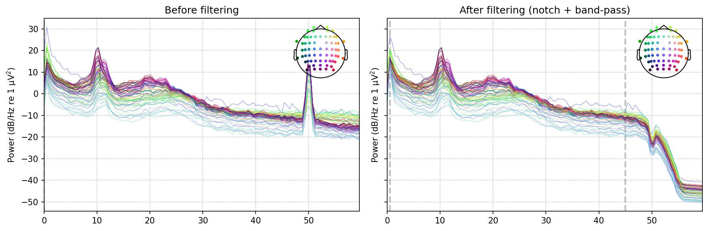
</p>
<p align="center"><em>Example power spectrum before and after filtering: the 50 Hz line-noise spike is removed and activity above 45 Hz is attenuated, while the physiological alpha peak (~10 Hz) is preserved.</em></p>

### 4. Spectral feature extraction (Notebook 03)
- **Quality control:** subjects with fewer than 10 clean epochs (40 s of data) were excluded, leaving **405 subjects (196 young, 209 old)**.
- **Power spectral density** was estimated with **Welch's method** (2 s windows, 50% overlap, 0.5 Hz frequency resolution), averaging spectra across windows and epochs for a stable estimate.
- **Relative band power** was computed at each of the 64 electrodes in five **non-overlapping** bands (delta 1-4 Hz, theta 4-8 Hz, alpha 8-13 Hz, beta 13-30 Hz, gamma 30-45 Hz): each band's power divided by the channel's total 1-45 Hz power. Relative power removes overall amplitude differences unrelated to brain rhythms (e.g. electrode contact, skull thickness) and keeps the balance between rhythms.
- **Individual alpha peak frequency**, a well-documented marker of aging (Klimesch, 1999), was estimated from posterior electrodes.

This gives **321 features per subject** (64 channels × 5 bands + 1). Subject age is deliberately excluded from the feature file to prevent data leakage.

<p align="center">
  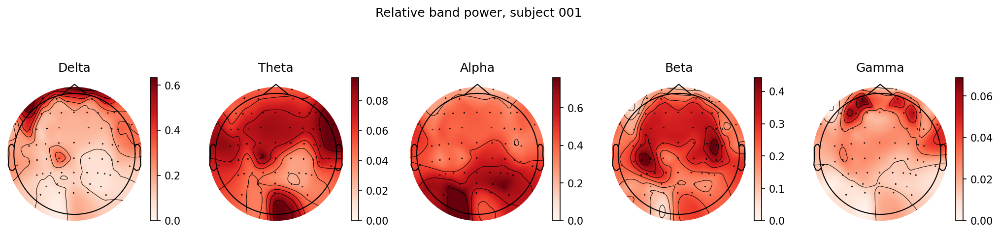
</p>
<p align="center"><em>Scalp distribution of relative band power for one example subject. As expected during eyes-closed rest, alpha is strongest over posterior (occipital) electrodes.</em></p>

### 5. Classification and evaluation (Notebook 04)
- **Models:** a majority-class chance baseline; an L2-regularized **logistic regression** on standardized features; and a **gradient boosting** classifier (ensembles of shallow decision trees built sequentially, each correcting the errors of the previous ones).
- **Nested cross-validation:** an outer 5-fold loop estimates performance on unseen subjects, while an inner 3-fold loop, using training data only, selects hyperparameters. Test subjects are never involved in any modeling decision, and since each row is one subject, no person can appear in both training and test data.
- **Metrics:** accuracy, balanced accuracy and ROC AUC.
- **Significance:** a label-permutation test (100 permutations) estimates how likely the observed performance would be if EEG carried no age information.
- **Interpretation:** grouped permutation importance (all 64 channels of a band shuffled together, since neighbouring electrodes carry correlated information) and feature-set ablations.

---

## Results

### Age-related differences in the EEG spectrum

| Whole-scalp median | Delta | Theta | Alpha | Beta | Gamma | Alpha peak |
|---|---|---|---|---|---|---|
| Young (n = 196) | 0.286 | 0.118 | **0.380** | 0.145 | 0.039 | **10.5 Hz** |
| Old (n = 209) | 0.279 | 0.104 | 0.293 | **0.214** | **0.057** | 10.0 Hz |

Older adults show **less alpha and theta, more beta and gamma**, and a **slightly slower alpha peak**, in line with the literature on the aging brain.

<p align="center">
  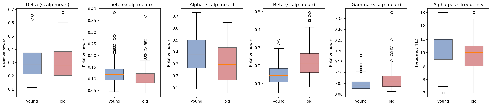
</p>

<p align="center">
  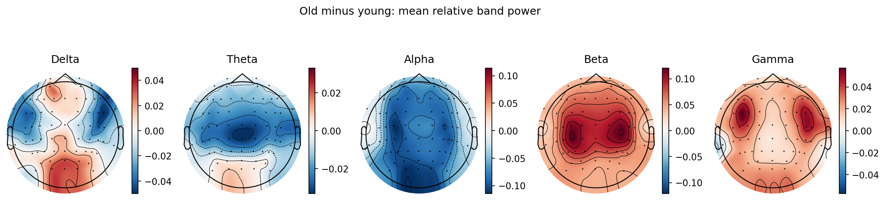
</p>
<p align="center"><em>Old minus young difference in relative band power at each electrode (red: higher in older adults). The beta increase is centred over bilateral central regions, while the gamma increase is concentrated at the lateral frontotemporal edges, where jaw and temple muscles sit.</em></p>

### Classification performance

Nested cross-validation (mean ± SD across 5 outer folds):

| Model | Accuracy | Balanced accuracy | ROC AUC |
|---|---|---|---|
| Chance baseline | 0.516 ± 0.006 | 0.500 ± 0.000 | 0.500 ± 0.000 |
| Logistic regression | **0.830 ± 0.029** | **0.829 ± 0.029** | **0.904 ± 0.027** |
| Gradient boosting | 0.795 ± 0.027 | 0.795 ± 0.027 | 0.895 ± 0.017 |

<p align="center">
  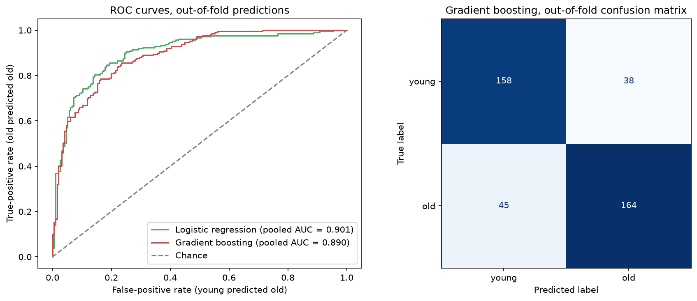
</p>
<p align="center"><em>Left: ROC curves from out-of-fold predictions. Right: gradient boosting confusion matrix; errors are balanced between younger (80.6% correct) and older (78.5% correct) adults.</em></p>

<p align="center">
  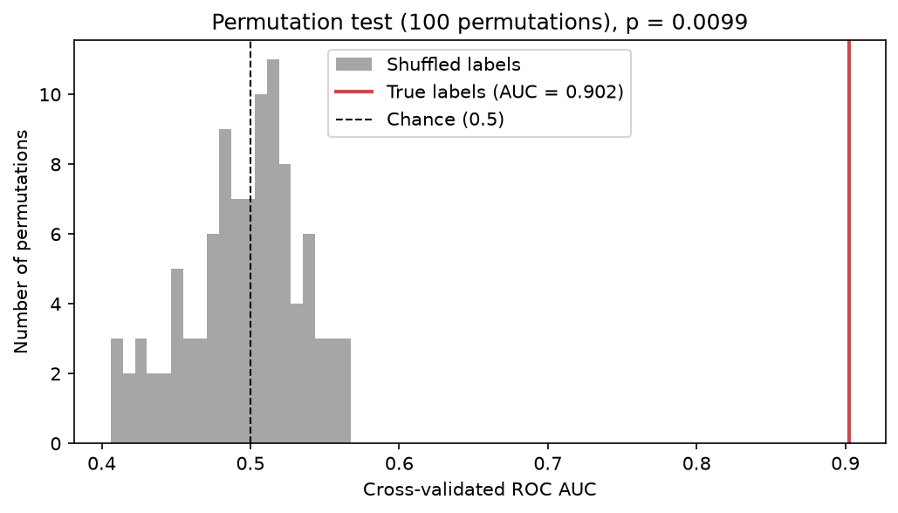
</p>
<p align="center"><em>Distribution of cross-validated ROC AUC under 100 random label shuffles (grey) versus the true labels (red): p = 0.0099.</em></p>

### What drives the predictions

<p align="center">
  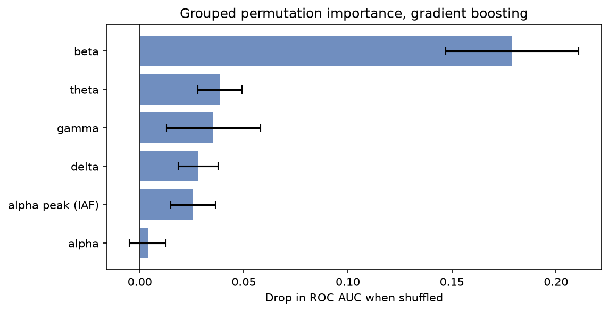
</p>

| Feature set (gradient boosting) | Features | ROC AUC |
|---|---|---|
| All features | 321 | 0.902 ± 0.018 |
| Without gamma | 257 | 0.895 ± 0.020 |
| Beta only | 64 | 0.812 ± 0.025 |
| Alpha + alpha peak | 65 | 0.783 ± 0.053 |
| Alpha peak only | 1 | 0.590 ± 0.085 |

<p align="center">
  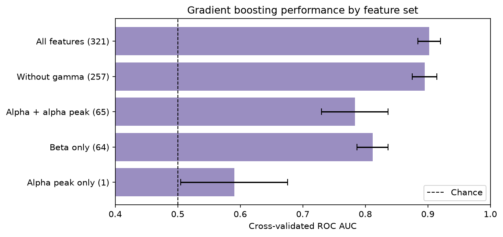
</p>

---

## Discussion

**Resting EEG carries a strong, robust age signal.** Both models classify unseen individuals far above chance, and the result survives a permutation test.

**A linear model is enough.** Logistic regression matched gradient boosting (the difference lies within one standard deviation across folds). The age-related spectral shift in this cohort appears to be largely additive across bands and electrodes, so the extra flexibility of tree ensembles brings no measurable benefit here, an informative result in its own right.

**Beta dominates, but should be interpreted carefully.** The beta band was by far the most important feature group, and on its own it reached ROC AUC 0.812. Because the features are *relative* powers, a higher beta share in older adults partly mirrors their reduced alpha. It may also reflect a flatter aperiodic (1/f) component of the spectrum, which has itself been linked to aging (Voytek et al., 2015) and which band-power measures cannot separate from true oscillations (Donoghue et al., 2020).

**Why alpha shows low importance.** Despite the largest raw group difference, shuffling alpha alone barely affected performance. Relative band powers sum to one, so alpha can be reconstructed from the other four bands: the model never truly loses that information. Used alone, alpha and the alpha peak frequency still reach ROC AUC 0.783.

**Not driven by muscle artifact.** Muscle activity overlaps with high-frequency EEG (Muthukumaraswamy, 2013), and the gamma group difference was concentrated at frontotemporal sites typical of muscle contamination. Removing all gamma features changed performance only marginally (0.902 → 0.895), so the classifier does not depend on it.

---

## Limitations

- **Extreme-groups design.** Excluding the middle third of ages (35-51) sharpens the contrast and makes classification easier than predicting age across the full continuum; performance on intermediate ages is untested.
- **Epoch-level artifact rejection.** A single noisy electrode causes a whole epoch to be discarded on all 64 channels. In the example recording, 9 of 10 rejected epochs were due to one electrode (CP1), and 11 subjects (7 young, 4 old) were excluded for having too few clean epochs. Bad-channel interpolation before rejection would retain more data.
- **No component-based artifact removal.** Ocular and muscle artifacts were handled by filtering, edge trimming and amplitude thresholds rather than independent component analysis (ICA). Muscle activity extends into the beta range, so beta is not entirely immune to it, although the central location of the beta difference points to a neural origin.
- **Compositional features.** Relative band powers are interdependent, which limits how importance can be attributed to any single band, and periodic and aperiodic contributions are not separated.
- **Single cohort.** Results come from one cross-sectional, single-site German cohort and have not been validated on an independent dataset.
- **Evaluation details.** The permutation test and ablations use hyperparameters selected on the full dataset, so their absolute values are slightly optimistic (comparisons between them remain valid); with 100 permutations, p cannot fall below 0.0099.

## Future directions

- **Continuous age prediction** (regression) and a "brain-age gap" analysis across the full 20-70 age range
- **Aperiodic and periodic parameterization** of each spectrum (specparam / FOOOF)
- **ICA-based artifact removal** and bad-channel interpolation
- **Fatigue × age:** comparing pre- and post-task recordings, a design this dataset uniquely supports
- **Longitudinal analysis** using the 5-year follow-up session
- **External validation** on an independent resting-state EEG cohort

---

## Repository structure

```
├── notebooks/
│   ├── 00_setup_and_metadata_exploration.ipynb
│   ├── 01_subject_subset_selection_and_data_access.ipynb
│   ├── 02_preprocessing.ipynb
│   ├── 03_spectral_feature_extraction.ipynb
│   └── 04_gradient_boosting_classifier.ipynb
├── data/
│   ├── cohort_labels.csv          # 416 labeled subjects and recording paths
│   ├── preprocessing_log.csv      # clean epochs per subject
│   └── spectral_features.csv      # 405 subjects × 321 features (model input)
├── figures/                       # all figures produced by the notebooks
├── results/                       # model comparison, band importance, ablation, summary.json
├── models/
│   └── gradient_boosting_age_classifier.joblib
├── requirements.txt
└── README.md
```

Raw EEG (~9 GB) is not stored in this repository; it is downloaded from OpenNeuro by Notebook 01.

## Reproducing the results

**Quick: rerun the modeling stage (a few minutes, no EEG download).** The feature matrix is included, so Notebook 04 runs immediately:

```bash
git clone https://github.com/<your-username>/eeg-age-classification.git
cd eeg-age-classification
python3 -m venv .venv
source .venv/bin/activate
pip install -r requirements.txt
```

Then open `notebooks/04_gradient_boosting_classifier.ipynb` and run all cells.

**Full pipeline.** Run Notebooks 00 → 01 → 02 → 03 in order on Google Colab (or any machine with ~10 GB of free disk space and a fast connection); each notebook installs what it needs and downloads data directly from OpenNeuro. Place the resulting `spectral_features.csv` in `data/` and run Notebook 04.

**Environment.** Notebooks 00-03: Python 3.13, MNE-Python 1.13.2 (Google Colab). Notebook 04: Python 3.12, scikit-learn 1.9.1. All random processes use a fixed seed (42).

---

## References

- Getzmann, S., Gajewski, P. D., Schneider, D., et al. (2024). Resting-state EEG data before and after cognitive activity across the adult lifespan and a 5-year follow-up. *Scientific Data*, 11, 988. https://doi.org/10.1038/s41597-024-03797-w
- Wascher, E., Schneider, D., Gajewski, P. D., & Getzmann, S. Dataset ds005385, OpenNeuro. https://doi.org/10.18112/openneuro.ds005385.v1.0.3
- Klimesch, W. (1999). EEG alpha and theta oscillations reflect cognitive and memory performance: a review and analysis. *Brain Research Reviews*, 29, 169-195. https://doi.org/10.1016/S0165-0173(98)00056-3
- Voytek, B., Kramer, M. A., Case, J., et al. (2015). Age-related changes in 1/f neural electrophysiological noise. *Journal of Neuroscience*, 35(38), 13257-13265. https://doi.org/10.1523/JNEUROSCI.2332-14.2015
- Donoghue, T., Haller, M., Peterson, E. J., et al. (2020). Parameterizing neural power spectra into periodic and aperiodic components. *Nature Neuroscience*, 23, 1655-1665. https://doi.org/10.1038/s41593-020-00744-x
- Muthukumaraswamy, S. D. (2013). High-frequency brain activity and muscle artifacts in MEG/EEG: a review and recommendations. *Frontiers in Human Neuroscience*, 7, 138. https://doi.org/10.3389/fnhum.2013.00138
- Gramfort, A., et al. (2013). MEG and EEG data analysis with MNE-Python. *Frontiers in Neuroscience*, 7, 267.
- Pedregosa, F., et al. (2011). Scikit-learn: Machine learning in Python. *Journal of Machine Learning Research*, 12, 2825-2830.

## Author

**Aleesha Hayat**: Computer Science undergraduate with a strong interest in computational neuroscience and neurotechnology. This project was built independently to develop hands-on experience with the full workflow of EEG research, from raw open data to statistically validated, interpretable results.

## License

Code in this repository is released under the MIT License. The underlying EEG data (OpenNeuro ds005385) is available under CC0.